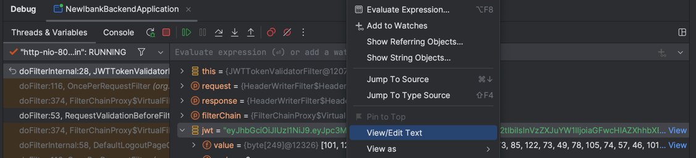

# Spring Security 6 從略懂至很熟
註：本練習專案是跟著 Spring Security 6, 0 to Master along with JWT, OAUTH2 課程實作

1. 為何要用Spring Security
   - 困境：Application security is not fun and challenging to implement with our custom code/framework.
     - Spring Security 是由Spring其中一組熟悉security團隊考慮過所有security scenarios情況下，所打造的框架。使用Spring Security，能在最少的配置條件下，確保web apps的安全，不用再重造輪子
     - Spring Security 處理了常見資安弱點，像是CSRF與CORs。對於任何被識別的資安弱點，因為很多機構組織都使用Spring Security，它會立即的進行更新、補強弱點
     - 使用 Spring Security，可以用最簡單少量的配置，保證專案的pages/API路徑、enforce roles、方法level security
     - Spring Security支援眾多security標準來實作驗證機制，例如username/password驗證、JWT tokens、OAuth2、OpenID等等
2. Spring Security 內部流程 / 架構
   
   1. User用credential發送請求
      - **Spring Security Filters** 決定是否要對 userRequest 實施驗證
   2. Spring Security Filter extract username and password into Authentication object. 用戶名以及密碼會被抽出封裝成Authentication物件
      - Authentication是Spring Security code standard
   3. Spring Security Filters將userRequest轉交給 AuthenticationManager 
   4. AuthenticationManager如其名，負責管理驗證邏輯，確認這個請求要用LDAP Server、Database、Authentication Server或者Cache等各種驗證提供者
      - 如果請求送給各驗證提供者都失敗，AuthenticationManager則負責告知user failed request
   5. Authentication Providers 有很多種，可以直接寫驗證邏輯，或者可以 leverage spring security provider interface into classes which are UserDetailsManager and UserDetailsService
   6. Password Encoder 給密碼加密
   7. AuthenticationProvider完成之後，傳回 AuthenticationManager
   8. AuthenticationManager再傳回SpringSecurityFilters
   9. SpringSecurityFilter將結果傳給end user之前，會先將那筆Authentication物件存進SecurityContext
      - 包含驗證是否成功、是否有sessionId等等
   10. 最終資料傳回end user
3. Servlets 與 Filters
   - ★ 一個web app內典型的情境
     - 在Java web app中，Servlet Container(web server)負責替Java程式翻譯HTTP訊息。其中最常用的servlet container為Apache Tomcat。 
     - Servlet Container將HTTP訊息轉換成ServletRequest，並將其作為參數遞給Servlet方法。
     - 同樣的，ServletResponse會從Servlet輸出到Servlet Container，所以Java web app裡面寫的程式都是由Servlet驅動
   - ★ Filter 過濾器的角色
     - Java web app裡的Filter用來攔截每個request/response，也負責商業邏輯執行前的事前作業
     - 使用相同的過濾器，Spring Security可以透過配置設定強化web app security
   > 翻成白話文就是：web/app server 裡面有一些filters和servlets，client客戶發送請求進AppServer，到達servlet之前，都會經過filters
4. 內部流程相關名詞解釋
   - Spring Security Filters: 是一系列的過濾器，用以攔截每個請求，會協同確認這一筆請求是否需要Authentication。如果需要，就會將user導至login頁面，或使用一開始儲存在authentication的既有details
   - `Authentication`: 例如 UsernamePasswordAuthenticationFilter 的過濾器會從http請求中提取username/password，並製作Authentication物件。
      Authentication此物件是Spring Security框架中，儲存已驗證的user details的核心標準
   - `AuthenticationManager`: 從過濾器接收到請求後，將user detail的驗證工作分配給可用的驗證提供者。一個app可能有多個提供者，
      會由AuthenticationManager管理
   - `AuthenticationProvider`: 所有驗證user的核心邏輯
   - `UserDetailsManager/UserDetailsService`: 協助取得、建立、更新、刪除資料庫或儲存系統中的userDetails
   - `PasswordEncoder`: 加密與哈希密碼的服務介面
   - `SecurityContext`: 一旦請求被驗證了，Authentication物件會被存放在執行緒區域(thread-local)的SecurityContext，
      這個物件由SecurityContextHolder管理，有助於驗證這個user之後發送的請求

### Ready to go through the filters? Go!
Spring Security Filters 有很多個，以下列出幾個較為重要的過濾器：
(Roles: helps to perform authentication, authorization, displaying the login page, storing the authentication details, etc.)
1. `AuthorizationFilter.java` 確認該url是否為公開或需要驗證授權的連結
2. `DefaultLoginPageGeneratingFilter.java` 如果user試圖存取securedURL，就會進入此過濾器，顯示給user看的預設登入頁
3. `UsernamePasswordAuthenticationFilter.java` 在user輸入帳密等credential後，會進入此過濾器
   - `attemptAuthention()`方法會建立Authentication物件
   - `UsernamePasswordAuthenticationToken.java` 為什麼要建立此？它實作了Authentication介面
   - 再藉由`ProviderManager`物件使上述的AuthenticationToken生效，這個ProviderManager實作了AuthenticationManager介面
   - 這個Manager裡的authenticate()方法會遍歷所有authenticationProviders，如果同時有兩個有效providers，其中一個先驗證成功，
     就不會執行第二個驗證，如果第一個驗證失敗了，就會繼續試第二個驗證

> pending question: 那要如何規範哪些頁面需要login，哪些不用？

### Sequence Flow - Spring Security預設行為

1. User trying to access a secure page for the first time.
2. Behind the scenes few filters like `AuthorizationFilter`, `DefaultLoginPageGeneratingFilter` identify that the user is not logged in & redirect the user to login page.
3. User entered his credentials and the request is intercepted by filters.
4. Filters like `UsernamePasswordAuthenticationFilter`, extracts the username, password from the request and form an object of `UsernamePasswordAuthenticationToken` which is an implementation of Authentication interface. With the object created it invokes `authenticate()` method of `ProviderManager`.
5. `ProviderManager` which is an implementataion of `AuthenticationManager` identify the list of Authentication providers available that are supporting given authentication object style. In the default behavior, `authenticate()` method of `DaoAuthenticationProvider` will be invoked by `ProviderManager`.
6. `DaoAuthenticationProvider` invokes the method `loadUserByUsername()` of `InMemoryUserDetailsManager` to load the user details from memory. Once the user details loaded, it takes help from the default password encoder implementation to compare the password and validate if the user is authenticated or not.
7. At last it returns the `Authentication` object with the details of authentication success or not to `ProviderManager`.
8. ProviderManager checks if authentication is successful or not. If not, it will try with other available AuthenticationProviders. Otherwise, it simply returns the authentication details to the filters.
9. The Authentication object is stored in the SecurityContext object by the filter for future use and the response will be returned to the end user.


- 當user發送多筆請求，Spring Security為什麼都不會跟他要credentials?
  - Storage -> Cookies (this url) -> Name: JSESSIONID。這個JSESSIONID以cookie形式儲存在瀏覽器browser裡面，這個cookie在之後的每個請求，也會被瀏覽器傳送給後端伺服器，

## 02-001 此package的backend REST services
- 不需要驗證授權的服務
  - `/contact`: 從『聯絡我們』頁面接收資料，存進DB
  - `/notices`：從資料庫傳送公告通知到『公吿消息』頁面
- 有security需求服務
  - `/myAccount`：將登入user的『帳戶明細』從DB傳至UI
  - `/myBalance`：將登入user的『餘額與交易明細』從DB傳至UI
  - `/myLoans`：將登入user的『貸款明細』從DB傳至UI
  - `/myCards`：將登入user的『信用卡明細』從DB傳至UI

- By default, Spring Security framework will try to secure all the services that you have inside our web application.

## 02-005 
- Spring Security預設會讓專案內所有路徑都受到保護 (需要credentials)，原因是出自於`SpringBootWebSecurityConfiguration`類別中的
`defaultSecurityFilterChain(HttpSecurity http)`方法
- 如果user指定他們自定義的SecurityFilterChain bean，這個類別就會完全停用
```java
static class SpringBootWebSecurityConfiguration {
    // ...
    @Bean
    @Order(SecurityProperties.BASIC_AUTH_ORDER)
    SecurityFilterChain defaultSecurityFilterChain(HttpSecurity http) throws Exception {
        //any request that is coming towards my app has to be authenticated⬇️
        http.authorizeHttpRequests((requests) -> requests.anyRequest().authenticated());
        //the request can come through a html form or from rest-api application or postman application
        http.formLogin(withDefaults());
        http.httpBasic(withDefaults());
        return http.build(); 
    }
    // ...
}
```

## 02-008
有時候客戶端會提一些奇怪需求，例如拒絕所有發送到app的api請求，使用SpringSecurity框架達成的話，如下程式
即便user輸入了帳號密碼，仍然只會收到 403 錯誤（通過驗證了，但並未授權）
even though your authentication is successful, but authorization is still denied. 

```java
@Configuration
public class ProjectSecurityConfig {
    /**
     * Configuration to deny all the requests
     */
    @Bean
    SecurityFilterChain defaultSecurityFilterChain(HttpSecurity http) throws Exception {
        http.authorizeHttpRequests()
                .anyRequest().denyAll()
                .and().formLogin()
                .and().httpBasic();
        return http.build();
    }
}
```

## 02-009
相對於上個情境，也會有允許所有請求的狀況（常見）
```java
@Configuration
public class ProjectSecurityConfig {
    /**
     * Configuration to permit all the requests
     */
    @Bean
    SecurityFilterChain defaultSecurityFilterChain(HttpSecurity http) throws Exception {
        http.authorizeHttpRequests()
                .anyRequest().permitAll()
                .and().formLogin()
                .and().httpBasic();
        return http.build();
    }
}
```

## 03-001
只有一個 user 哪夠？
如何將user credentials存進資料庫，再用db驗證

## 03-002
建立多個users---Approach 1
- 使用 InMemoryUserDetailsManager
- 不適合用於生產/正式環境
- 使用 `withDefaultPasswordEncoder()`(deprecated)
- 方法標註`@Bean`表示此方法回傳的物件會被轉換成一個bean
```java
@Configuration
public class ProjectSecurityConfig {
    // ...
    @Bean
    public InMemoryUserDetailsManager userDetailsService() {
        UserDetails admin = User.withDefaultPasswordEncoder()
                .username("admin")
                .password("99999")
                .authorities("admin")
                .build();
        UserDetails user = User.withDefaultPasswordEncoder()
                .username("user")
                .password("88888")
                .authorities("read")
                .build();
        return new InMemoryUserDetailsManager(admin, user);
    }
}
```

## 03-003
建立多個users---Approach 2
- 分別建立PasswordEncoder的bean
- 使用NoOpPasswordEncoder的實例
- 密碼未加密，也不適合production環境
```java
@Configuration
public class ProjectSecurityConfig {
    // ...
    /**
     * Approach 2: where we use NoOpPasswordEncoder Bean while creating user details
     * @return InMemoryUserDetailsManager
     */
     @Bean
     public InMemoryUserDetailsManager userDetailsService() {
         UserDetails admin = User.withUsername("admin")
                 .password("99999")
                 .authorities("admin")
                 .build();
         UserDetails user = User.withUsername("user")
                 .password("88888")
                 .authorities("read")
                 .build();
         return new InMemoryUserDetailsManager(admin, user);
     }

     /**
      * Approach 2 is only for non-prod, as it treats password as plain text.
      * @return PasswordEncoder
      */
     @Bean
     public PasswordEncoder passwordEncoder() {
         return NoOpPasswordEncoder.getInstance();
     }
}
``` 
## 03-004
用戶管理相關的類別與介面
- `UserDetailsService` \[介面] 核心介面，加載user特定的資料
  - `loadUserByUsername(String username)`
- `UserDetailsManager` \[介面] 繼承UserDetailsService，提供建立新users並更新既有users的功能
  - `createUser(UserDetails user)`
  - `updateUser(UserDetails user)`
  - `deleteUser(String username)`
  - `changePassword(String oldPwd, String newPwd)`
  - `userExists(String username)`
- Spring Security提供的實作類別
  - `InMemoryUserDetailsManager`
  - `JdbcUserDetailsManager`
  - `LdapUserDetailsManager`
上述這些介面與類別都使用了`UserDetails`介面，提供基本user資料
  - `User`實作了`UserDetails`

## 03-005
- 保障安全性的設計模式：User或UserDetails都沒有欄位的setter，即建構子注入欄位值之後就不可覆寫或更改
- Authentication與UserDetails之間的關聯
  - UserDetails介面與實作的User類別
    - 是當你要從儲存系統加載用戶資料時，會回傳的類型
    - 例：UserDetailsService與UserDetailsManager裡面的方法
    - 常用方法
      - getPassword()
      - getUsername()
      - getAuthorities()
      - isAccountNonExpired()
      - isAccountNonLocked()
      - isEnable()
      - isCredentialsNonExpired()
      - eraseCredential()
  - `Principal`介面、`Authentication`介面與`UsernamePasswordAuthenticationToken`類別
    - 是當你要決定驗證結果成功與否的情境中，會回傳的類型
    - 例：AuthenticationProvider與AuthenticationManager裡面的方法
    - 常用方法
      - getName()
      - getPrincial()
      - getAuthorities()
      - getCredentials()
      - getDetails()
      - isAuthenticated()
      - setAuthenticated()
      - eraseCredentials()
  
## 03-006
- `UserDetailsService`介面
  - 適用於加載特定用戶資料的情境
  - 方法 `loadUserByUsername(String username)`
- `UserDetailsManager`，繼承`UserDetailsService`的介面
  - 可以新增user或更新/刪除既有user
  - 方法 
    - `changePassword(String, String)`
    - `createUser(UserDetails)`
    - `deleteUser(String)`
    - `loadUserByUserNamd(String)`
    - `updateUser(UserDetails)`
    - `userExists(String)` 

## 03-007
Spring Security提供的三個實作類別
1. InMemoryUserDetailsManager
   - 當建構了這一個物件，傳入的UserDetails(1~多筆)會被for-loop，每筆丟進`createUser(User)`方法
   - `createUser(UserDetails)`如果不是既有存在的username，則會將這筆userDetail存進map(k:username小寫, v:MutableUser物件)
2. JdbcUserDetailsManager
   - Q: 資料表結構為何？欄位名稱為何？要把userDetails存在哪？A: Spring Security有預設一個DB結構、table結構、欄位名稱
   - `JdbcDaoImpl` - select username, password, enabled from users where username = ?
     - 資料表名稱預設為users，相關資料在 users.ddl 裡面
     - 除了users對應authorities，也可以使用`GroupManager`建立群組，並將user分配進所屬群組
3. LdapUserDetailsManager
   - 要先加入兩個依賴 `spring-security-ldap` & `spring-ldap-core`
   - 不是很常用，除非專案有用到Ldap儲存用戶訊息

## 03-008
MySQL cloud server
- 可以用 AWS amazon free tier 建立
  - RDS如果stop temporarily要一週後才能重啟（希望沒有聽錯）
  - 趕快做完實作，趕緊刪庫，以免扣錢
- 使用連結 [Free MySQL Hosting](https://www.freemysqlhosting.net/)
  - 不會跟你要信用卡號碼
  - 但每週都會寄信確認你還有沒有在使用
  - 不確定何時會中止免費服務

## 03-009
[SQL Ectron](https://sqlectron.github.io/)
- 輸入先前在AWS建立資料庫的User帳號名稱 `admin` 與密碼
- Database type選這專案要使用的MySQL
- Server Address Host貼上AWS>RDS>springsecurity>Connectivity & security>Endpoint & port的Endpoint
- 建立資料庫 newIBank
- 執行Security JAR檔案的 users.ddl➡️fail
- 使用Security官方文檔案的 [JDBC_users schema](https://docs.spring.io/spring-security/reference/servlet/authentication/passwords/jdbc.html) ➡️fail
- 加入一筆用戶happy
- 相關ddl放在 resources/sql 路徑之下 (scripts.sql)

## 03-010
- 因為要實作JdbcUserDetailsManager，故須增加三個dependencies
  - spring boot starter jdbc 資料庫連線
  - my sql connector-j 要連接的資料庫
    - scope 設定 runtime
  - spring boot starter data jpa 執行資料庫相關交易
- load maven changes (Intellij mac 快捷鍵：`shift⇧` + `command⌘` + `I`)
- 在application.properties設定檔案加入配置
- ProjectSecurityConfig中，與InMemoryUserDetailsManager相關的方法，註解之
- ProjectSecurityConfig 加入以下方法
  ```java
  public class ProjectSecurityConfig {
      //...
      @Bean
      public UserDetailsService userDetailsService(DataSource dataSource) {
          return new JdbcUserDetailsManager(dataSource);
      }
  }
  ```
  - 為何回傳物件可以這樣寫？因為JdbcUserDetailsManager實作了UserDetailsManager介面，而此介面繼承了UserDetailsService介面
- 上一個approach其中一個方法建立的PasswordEncoder仍要保留，為何？
  - You should always communicate to spring security how our passwords are stored. Whether they are stored in plain text password or hashing/encryption.
- 後續會示範如何store password in encrypted format

## 03-011
建立自定義的 users table (客戶說：我想透過email驗證,要增加email欄位, 我想要用更符合我司習慣的欄位命名)
- 這樣的情況就不能用JdbcUserDetailsManager了，要自己實作`UserDetailsService`以及`UserDetailsManager`
- 首先建立一個 customer 資料表 (參考本專案 scripts.sql)，其它下回分曉

## 03-012
- 建立package`model`，裡面新建class`Customer`，類別加上標註`@Entity`
  - `@Entity`:
    - 是 spring data jpa 框架的標註型別
      - 指的是要被建立的該類別，即代表database其中一張資料表
  - `@Id`: act as a primary key
  - `@GeneratedValue(strategy=GenerationType.AUTO)`
    - no need to provide manually, instead, the framework will work with the database server 
      and automatically generate the next id value that is available inside the database
- 建立package`repository`，裡面新建class`CustomerRepository`
  - 繼承自 JpaRepository<T, type of the field per T that is annotated with @Id> 
  - 此介面以`@Repository`標註
- 如果這兩個 java class 是建立在 main package (newibankbackend) 以外的地方，要在程式入口點main()所在的類別加上兩個標註：
  - `@EntityScan("com.march.nibbackend.model")`
  - `@EnableJpaRepositories("com.march.nibbackend.repository")`
  - 用以要求Spring去掃描這些類別並建立beans，供後續商業邏輯使用
- 另外在主程式類別上面掛標註`@EnableWebSecurity`
  - 如果你建立的SpringSecurity的專案，就不必掛這個annotation
  - 適用在專案沒有spring-security dependency的情況

## 03-013
接下來要用自定義的table建立對應的UserDetailsManager
- 要實作 UserDetailsService 介面，覆寫`loadUserByUsername()`方法，回傳UserDetails
- 在config package底下，新建類別`NewIBankUserDetails`，實作 UserDetailsService 介面
  - GrantedAuthority: interface from java library
  - SimpleGrantedAuthority: class from spring security
  - 這類別要加上`@Service`標註，才能creating this class as a bean
  - 目前產生兩個實作UserDetailsService的bean，會使DaoAuthenticationProvider混淆
    - `No AuthenticationProvider found for ...UsernamePasswordAuthenticationToken`
    - 解：先註解 ProjectSecurityConfig 產生 UserDetailsService bean 的方法
    - 這樣就能順利使用 customer 表裡面的 user 登入了
    ```java
    @Service
    public class NewIBankUserDetails implements UserDetailsService {

      @Autowired
      CustomerRepository customerRepository;

      @Override
      public UserDetails loadUserByUsername(String username) throws UsernameNotFoundException {
        String userName = null;
        String password = null;
        List<GrantedAuthority> authorities =  new ArrayList<>();
        List<Customer> customer = customerRepository.findByEmail(username);
        if (customer.isEmpty()) {
            throw new UsernameNotFoundException("User details not found for the user: " + username);
        } else {
            userName = customer.get(0).getEmail();
            password = customer.get(0).getPwd();
            authorities.add(new SimpleGrantedAuthority(customer.get(0).getRole()));
        }
        return new User(username, password, authorities);
      }
    }
    ```
    
## 03-014
註冊新用戶---新增一支REST API
- 有兩種方式達成 (1) 實作UserDetailsManager; (2) 修改loadUserByUsername方法
- 建立一個`LoginController`，registerUser方法
- 先取消csrf，在ProjectSecurityConfig修改方法defaultSecurityFilterChain
- 修改 customer model 的 id欄位標註
  ```java
  @Entity
  public class Customer { 
      @Id
      @GeneratedValue(strategy = GenerationType.AUTO, generator = "native")
      @GenericGenerator(name="native", strategy="native")
      private Long id;
      //other fields
  }
  ```
- 再用postman測試註冊，註冊成功後就可以在UI登入


## 04-001
- 預設的PasswordEncoder是如何驗證密碼的？
  - 純文字比對密碼會有機密問題，不適合正式環境
  - 實際可查看`DaoAuthenticationProvider`類別中的`additionalAuthenticationChecks`方法
  - `this.passwordEnoder`當前使用的是NoOpPasswordEncoder，`matches(CharSequence, String)`不夠secure

## 04-002
密碼管理的不同方式：比較Encoding, Encryption以及Hashing
- Encoding 編碼
  - 將資料從一種格式轉換(convert)為另一格式的程序，與加密學無關
  - 沒有秘密，完全可逆的
  - 編碼不能用來保障資料安全，不適用於密碼管理
  - 編碼常用演算法：ASCII, BASE64, UNICODE
- Encryption 加密
  - 改變(transform)資料內容的程序，可以保證機密性
  - 為了達成機密係，加密必須有一把鑰匙(key)
  - 可以用key逆向得到原本文的內容，只要key保有機密性，加密就能保障安全
- Hashing 哈希/雜湊演算法
  - 使用hashing函式將資料轉換為hash value
  - hashed資料不可逆，無法用產生的hash value推回原文
  - 如果給定一些原始資料與哈希後的對照組，就能驗證雜湊後的值是否與原始值匹配


## 04-004
- Bcrypt是雜湊演算法其中一種
- Rounds of hash預設是12
- 如果原始文本相同，hash rounds不變，每一次的bcrypt-hash encrypt結果還是會不同
- 登入時：Hash to check 就會是存在DB的文本，比對 String to check against 用戶輸入的密碼
[Bcrypt-online generator](https://bcrypt-generator.com/)
- Given some arbitrary data along with the output of a hashing algorithm, one can verify whether this data matches the original input data without needing to see the original data.

## 04-005
PasswordEncoder interface
- PasswordEncoder介面有三個方法
  ```java
  public interface PasswordEncoder {
    String encode(CharSequence rawPassword);
    boolean matches(CharSequence rawPassword, String encodedPassword);
    // 密碼是否要再加密一次
    default boolean upgradeEncoding(String encodedPassword) {
      return false;
    }
  }
  ```
- PasswordEncoder介面的不同實作類別
  - `NoOpPasswordEncoder` (not for prod)
  - `StandardPasswordEncoder` (not for prod)
  - `Pbkdf2PasswordEncoder`
  - `BCryptPasswordEncoder`
  - `SCryptPasswordEncoder`
  - `Argon2PasswordEncoder`

## 04-006
PasswordEncoder 的實作類別
- `NoOpPasswordEncoder` (not for prod)
  - 純文字比對，存進資料表之前不加密
- `StandardPasswordEncoder` (not for prod)
  - Deprecated class
  - 只用來支援舊系統(for legacy purpose)
- `Pbkdf2PasswordEncoder`
  - 一樣不建議用於正式環境
  - 5~6年前還算secured，但現在GPU brute force attack緣故，變成中等強度了

#### Brute force attack是什麼
假設一個駭客取得了驗證用的資料表，有其中一兩個user使用了弱強度的密碼，
他就能很快猜出對應的原始文本。可能會寫一個程式，會一直傳進最常用的密碼，
以及最常用的字典詞彙，不對就繼續餵常用密碼，會需要很多processing與memory性能，
開發人員有兩種方法可以 delay hacking logic:
(1) 教育end user不要使用簡單的密碼，在輸入欄位驗證大小寫/符號/英數字
(3) 使用比較強的hashing algorithm，例如BCrypt或SCrypt

## 04-007
PasswordEncoder 的實作類別
- `BCryptPasswordEncoder`
  - B-crypt hashing algorithm, invented in 1999
  - demand computations power(GPU/CPU) from hacker mission
  - the most common application
- `SCryptPasswordEncoder`
  - C-crypt is advanced version of B-crypt password encoder
  - demand two parameters: computation power, memory allocation(RAM)
- `Argon2PasswordEncoder`
  - Even more latest algo
  - three dimension parameters: computation power, memory, multiple threads
  - but it also takes longer time for your web app to hash during login time

## 04-008
Demo: BCryptPasswordEncoder, new user registration
- 首先在 ProjectSecurityConfig 建立 PasswordEncoder 的地方，改為回傳 `new BcryptPasswordEncoder()`
- 接著，LoginController 的`registerUser()`方法中加入 `passwordEncoder.encode(String)`，存進Customer物件再存入table

## 04-009
Demo: BCryptPasswordEncoder, user login
- Pattern: 首字母 $2a或$2y或$2b(三種version)
- BCryptPasswordEncoder建構子：可以設定 version, secureRandom(salt加鹽), strength(log rounds雜湊幾次), 或者都用預設的
  - version: $2a或$2y或$2b，預設為$2a
  - strength (workload factor/log rounds): 最低4次，最高31次，預設為10次
  - secure random value: 隨機產生的數值，用來讓hacker mission更加崎嶇
- `BCrypt.checkpw(rawPwd, encodedPwd)`方法:
  1. The rawPwd will be hashed in the same strength, same version
  2. It's going to check the hash value is the same for the two hash strings. 
- 如果使用了先前 NoOpPasswordEncoder 存進 table 的 user 資料登入，會`log.warn("Encoded password does not look like BCrypt");`

> pending question: 那`AESxRSA` + BCryptPasswordEncoder是怎麼實作的？

## 05-001
如何自定義 AuthenticationProvider
- 當前是使用 DaoAuthenticationProvider，SpringSecurity提供的，可滿足大部分的情境locked、account expired、credential expired
- 但客戶可能會要求只有特定國家，或者年紀超過18才能進入系統，這樣就需要自定義AuthenticationProvider
- `AuthenticationProvider`預設實作的責任就是將 “從系統中找到該筆user" 的工作分配給 
  “UserDetailsService的實作類、以及執行密碼驗證的PasswordEncoder”
- 而 "`ProviderManager` (AuthenticationManager的實作）" 負責與所有`AuthenticationProviders`的實作確認並驗證user
- 如果有三種不同情境 (帳密驗證、OAUTH2驗證、OTP驗證)，就可以寫三種 `AuthenticationProviders`，
  再由 `ProviderManager` 調用對應的 `AuthenticationProvider`

## 05-002
暸解AuthenticationProvider的方法
```java
import org.apache.tomcat.util.net.openssl.ciphers.Authentication;
import javax.naming.AuthenticationException;

public interface AuthenticationProvider {
    Authentication authenticate(Authentication authentication) throws AuthenticationException;
    boolean supports(Class<?> authentication);
}
```
- `authenticate(Authentication)`: 接收並回傳Authentication物件，可以將自定義的驗證邏輯寫在此方法中
- `supports(Class<?> authentication`: 如果當前的AuthenticationProvider支援此類型的Authentication物件，就回傳true
  - TestingAuthenticationProvider 的supports方法
    ```java
    public class TestingAuthenticationProvider implements AuthenticationProvider {
        //...
        @Override
        public boolean supports(Class<?> authentication) {
            return TestingAuthenticationToken.class.isAssignableFrom(authentication);
        }
    }
    ```
  - DaoAuthenticationProvider 繼承 AbstractUserDetailsAuthenticationProvider 的supports方法
    ```java
    public abstract class AbstractUserDetailsAuthenticationProvider {
        // ...
    	@Override
		public boolean supports(Class<?> authentication) {
			return (UsernamePasswordAuthenticationToken.class.isAssignableFrom(authentication));
		}
    }
    ```

## 05-003
實作自定義的AuthenticationProvider
1. config package 增加 xxxxxAuthenticationProvider，實作介面AuthenticationProvider
2. `supports(Class<?>)` 這裏使用UsernamePasswordAuthenticationToken
3. `authenticate(Authentication)` 寫自己的驗證邏輯
   1. 從DB資料表撈取UserDetails
   2. 驗證密碼、如果吻合就更新authoritiesDetails
   3. 其他像是國籍或年齡的驗證，會寫在這個方法
   ```java
   @Component
   public class NewIBankUsernamePwdAuthenticationProvider implements AuthenticationProvider {
       // ...
       @Override
       public Authentication authenticate(Authentication authentication) throws AuthenticationException {
           String username = authentication.getName();
           String pwd = authentication.getCredentials().toString();
           List<Customer> customer = customerRepository.findByEmail(username);
           if (customer.isEmpty()) {
               if (passwordEncoder.matches(pwd, customer.get(0).getPwd())) {
                   List<GrantedAuthority> authorities = new ArrayList<>();
                   authorities.add(new SimpleGrantedAuthority(customer.get(0).getRole()));
                   return new UsernamePasswordAuthenticationToken(username, pwd, authorities);
               } else {
                   throw new BadCredentialsException("Invalid password");
               }
           } else {
               throw new BadCredentialsException("No user registered with this details");
           }
       }
   }
   ```
4. 最後要讓Spring Security能偵測到這個類別的Bean，需要在類別加上`@Component`標註

## 05-004
- 因為已經建立自定義的AuthenticationProvider，就不用再借助UserDetailsService，故刪除NewIBankUserDetails
  - 原因：不會再用到DaoAuthenticationProvider

## 05-005
- 回顧先前的Sequence Flow，使用自定義的AuthenticationProvider會在步驟六負責從table加載資料
- 不會再用到UserDetailsService、UserDetailsManager的實作類別JdbcUserDetailsManager，或者客製的實作類別
- 簡易版Sequence Flow如下
  


## 06-001
CORS and CSRF
- Cross-origin resource sharing 以及 Cross-site request forgery
- 如何使用Spring Security處理上述兩個問題
- 只用Postman應該無法實現這兩個議題，所以要用angular client呈現

## 06-002
- 請參考 [security516frontend](https://github.com/wysiwyz/security516frontend)

## 06-003
- 建立七張對應的tables，參考本專案scripts.sql檔
  - `customer` 客戶信息
  - `accounts` 客戶的帳戶資料，包含FK:customer_id
  - `account_transactions` 用戶的帳戶交易紀錄
  - `loans` 客戶的貸款資料，包含FK:customer_id
  - `cards` 客戶的信用卡資料，包含FK:customer_id
  - `notice_details` 公告消息
  - `contact_messages` 與我們聯絡 ✰

## 06-004
- 建立對應的repositories以及controllers
- 基於單一職責原則，也自行建立了對應的services，這樣controller method較乾淨

## 06-005
- 驗證 register api 是否運作正常

## 06-006
CORs error
- 驗證 get notices api 在 postman 正常運行
- 但是在UI DevTool console卻會拋出錯誤：
  ```
  Access to XMLHttpRequest at 'http://localhost:8080/notices' from origin 'http://localhost:4200' has been blocked by CORS policy: 
  Response to preflight request doesn't pass access control check: 
  No 'Access-Control-Allow-Origin' header is present on the requested resource.
  ```

## 06-007
簡介CORS (Cross-origin resource sharing)
- CORS is a protocol that enables scripts running on a browser client to interact with resources from a different origin. 
- For example, if a UI app wishes to make an API call running on a different domain, it would be blocked from doing so by default due to CORS.
- It's a specification from W3C implemented by most browsers.
- 因此，CORS並不是什麼資安議題，而是瀏覽器提供的預設保護，以阻止不同來源之間的資料流溝通
- `other origins`的定義：要被存取的URL位址與JavaSript正在運行的URL位址不同，哪裡不同？
  - 不同 scheme (HTTP or HTTPs)
  - 不同域名 domain
  - 不同埠號 port

## 06-008
要如何排除 CORS issue？有兩個方法
- 當一個Web app UI部署在一個server，要跟部署在另外一個server的REST service溝通時，可以透過`@CrossOrigin`標註達成
- `@CrossOrigin`允許任何domain的client side消費REST Service的API
- 這個標註列在類別上，有兩種寫法
  1. `@CrossOrigin(origins="localhost:4200")`- 指定特定域 \[嚴格]
  2. `@CrossOrigin(origins="*")` - 允許任何domain
- 但是如果有很多個Controllers，未來要修改origins裡面的參數會很麻煩
- 所以Spring Security提供了security filter chain其中一個bean的創建，如下範例：
  ```java
  public class ProjectSecurityConfig {
      @Bean
      SecurityFilterChain defaultSecurityFilterChain(HttpSecurity http) throws Exception {
          http.cors().configurationSource(new CorsConfigurationSource() {
              @Override
              public CorsConfigurationSource getCorsConfiguration(HttpServletRequest request) {
                  CorsConfiguration config = new CorsConfiguration();
                  config.setAllowedOrigins(Collections.singletonList("http://localhost:4200"));
                  config.setAllowedMethods(Collections.singletonList("*"));
                  config.setAllowedCredentials(true);
                  config.setAllowedHeaders(Collections.singletonList("*"));
                  config.setMaxAge(3600L); // 瀏覽器要記住這些配置,為期至多一小時
                  return config;
              }
          }).and().authorizeHttpRequests()
                  .requestMatchers("/myAccount", "/myBalance", "/myLoans").authenticated()
                  .requestMatchers("/notices", "/contact", "/register").permitAll()
              .and().formLogin() 
              .and().httpBasic();
          return http.build();
      }
  }
  ```

## 06-009
- defaultSecurityFilterChain 方法修改完畢後，在UI測試點`notices`導覽按鈕，可以看到Network -> type: preflight
- 另外 ResponseEntity 可以設定`cacheControl()`，規定幾秒鐘內重發送的請求，不用再重送api，適用於不常變化的資料源

## 06-010
CSRF - security vulnerability
- 為避免CSRF，Spring Security 預設不允許任何create或update的操作，因此Post或Put的請求都會收到 HttpStatus.403_FORBIDDEN

## 06-011
CSRF (Cross-Site Request)
- A typical cross-site request forgery (CSRF or XSRF) attack aims to perform an operation in a web application on behalf of a user without their explicit consecnt.
- In general, it doesn't directly steal the user's identity, but it exploits the user to carry out an action without their will.
- 想像你在使用`netflix.com`網站與攻擊者的網站`evil.com`
  1. 網飛用戶登入網站，網飛後端伺服器會提供一個針對 domain name=`netflix.com`的cookie存在瀏覽器
  2. 該名用戶在幾十分鐘後，在此瀏覽器另開一個分頁打開了`evil.com`
     - `evil.com`回傳一個網頁，其中包含嵌入式惡意連結，會變更網飛帳號的電子信箱，但這惡意連結標題意圖讓你上鉤 (例：手機全館1折)
  3. 當此用戶天真的點了這個惡意連結，這連結會自動向網飛發出變更電子郵件的請求
     - 由於瀏覽器已經存了cookie，網飛無法辨別請求是從實際用戶或惡意網站發送，這裡的`evil.com`就偽造了一個像是從網飛UI頁面發送的請求
       ```html
       <form action="https://netflix.com/changeEmail" method="POST" id="form">
           <input type="hidden" name="email" value="user@evil.com">
       </form>
       
       <script>
           document.getElementById('form').submit();
       </script>
       ```
       
## 06-012
CSRF的解決方案
- To defeat a CSRF attack, application need a way to determine if the HTTp request is legitimately generated via the app's user interface.
- The best way to achieve this is through a **CSRF token** --- a secure random token that is used to prevent CSRF attack.
- The token needs to be unique per user session, and should be of **large random value** to make it difficult to guess.
- 複現之前的情境：
  1. user登入網飛網頁，網飛後台會提供一個針對網飛domain的cookie存在瀏覽器，
      同時也對這一個特定user session給予一個隨機產生的CSRF token，
      (CSRF token is inserted within hidden parameters of HTML forms to avoid exposure to session cookies)
  2. user開啟了`evil.com`又不小心點了釣魚惡意連結，惡意連結發送了變更請求
  3. 網飛預期這個請求會提供cookie以及CSRF token，而且這個CSRF token必須與登入操作產生的token醫治
      如果 CSRF token 與登入取得的 CSRF token 不一致，就會回傳 HttpStatus.403
- If there's not CSRF solution implemented inside a webapp, 
    Spring Security by default blocks all HTTP POST/PUT/DELETE/PATCH operations with 403 error.
- `http.csrf().disable()` NOT for production environment

## 06-013
Ignore CSRF protection for public apis
- `.and().csrf().ignoringRequestMatchers("/contact", "/register")`
- 由於`notice`是get方法，就不用特別加上去
- 下一節要講 (比較重要的) protected apis

## 06-014
1. ProjectSecurityConfig 的 defaultSecurity方法中新增一個 `CsrfTokenReuqestAttributeHandler`並定義attribute name
2. 在 chain_method 裡面
   ```
   .csrf((csrf) -> csrf.csrfTokenRequestHandler(requestHandler))

   ```
3. `CookieCsrfTokenRepository.withHttpOnlyFalse()`:
   告訴SpringFramework要『建立一個csrf cookie，配置為httpOnlyFalse，這樣部署在angular的JavaScript就可以讀取cookie
4. 建立 filter 套件，裡面新增`CsrfCookieFilter.java`類，並繼承`OncePerRequestFilter`
5. 在配置csrf之後加入`addFilterAfter(new CsrfCookieFilter(), BasicAuthenticationFilter.class)`
   參數#1傳入自定義的filter，參數#2則是使用 httpBasicAuthentication 時候會用到的Spring framework filter
6. 最後，在cors配置之前加入以下程式碼
   - tell spring security framework: please create the JSESSIONID by following these session management created here
   - please always create the JSESSION id after the initial login has completed
   ```
   http.securityContext().requireExplicitSave(false)
       .and().sessionManagement(session -> session.sessionCreationPolicy(SessionCreationPolicy.ALWAYS))
       .cors()...
   ```
7. 修改前端登入程式碼，使它能讀取cookie並存進session storage

---

## 07-001
比較 Authentication & Authorization
#### Authentication
- 『驗證』確認用戶的身份，以提供系統的存取權
- 『驗證(AuthN)』永遠在授權之前進行
- 需要用戶的登入資料
- 若驗證失敗，通常會拿到401 error response
- 例如：銀行客戶或銀行在使用app行為時，需要先提供身份

#### Authorization
- 『授權』確認人員/用戶的authorities，以提供資源的存取權
- 『授權(AuthZ)』永遠在驗證之後進行
- 需要用戶的 privilege or roles
- 若授權失敗，會得到 401 error response
- 一旦登入app，用戶的 roles 與 authorities 會決定用戶能做哪些行動

## 07-002
Spring Security如何存Authorities?
- Spring Security把Authorities/Roles相關資訊存在`GrantedAuthority`物件裡，其當中只有一個方法，回傳authority/role的名稱
  ```java
  public interface GrantedAuthority {
      String getAuthority();
  }
  ```
- `SimpleGrantedAuthority`是Spring Security中，`GrantedAuthority`介面預設的實作類別
  ```java
  import org.springframework.security.core.GrantedAuthority;  
   
  public final class SimpleGrantedAuthority implements GrantedAuthority {
      private final String role
      public SimpleGrantedAuthority(String role) {
          this.role=role;
      }
      @Override
      public String getAuthority() {
          return this.role;
      }
  }
  ```
  
- How is Authorities info stored inside the objects of UserDetails and Authentication interfaces with plays a vital role during authentication?
  - `User` (實作UserDetails介面) 類別的`getAuthorities()`方法
  - `UsernamePasswordAuthenticationToken` (實作Authentication介面) 類別的`getAuthorities()`方法

## 07-003
目前資料表customer的欄位`role`只能放單一一種角色，所以要建立新表以定義任意數量的roles與authorities，相關ddl放在`scripts.sql`檔案裡

## 07-004 
使用新資料表讀取authorities：相關JPA程式異動
- 建立新資料表 `Authority`
  - field Customer customer
    - `@ManyToOne`: to establish this link between Customer and Authority, meaning many number of authorities can be mapped to a single customer
    - `@JoinColumn(name="customer_id")`: to convey to spring data JPA that this Authority has link to parent table `customer`
    - 補充：`@ManyToMany` --- a singular authorities can be assigned to many customers.
- 調整原本的 `Customer` entity
  - `@OneToMany(mappedBy = "customer")`: to convey to Spring data JPA that a single record of `Customer` can be mapped to many records inside of `Authorties` table
    - 注意 mappedBy 放的參數要與 Authorities 中對應的欄位一致
  - `FetchType.EAGER`: 當Spring data JPA要加載customer資料時，也要勤勞地加載該筆authorities資料
  - `@JsonIgnore`: 當你在類別中任一field加上此標註，表示它不會被轉進Json response送給UI前端application
    - 另一欄位`pwd`不加此標註的原因：
      - 前端需要傳pwd進backend，所以要改用`@JsonProperty(access=JsonProperty.Access.WRITE_ONLY)`
      - 這樣UI就能傳pwd進Backend，但Database的 hashed pwd就不會被傳回UI application
- 接著修改AuthenticationProvider
  - 加入helperMethod，把Set of Authority entity轉成List of GrantedAuthority

## 07-005
在Spring Security配置Authorities有三種方式
1. `hasAuthority()`
   - It accepts a single authority for which the endpoint will be configured and user will be validated against the single authority mentioned.
   - Only users having the same authority configured can invoke the endpoint.
   - 針對端點配置單一一個權限
2. `hasAnyAuthority()`
   - It accepts multiple authorities for which the endpoint will be configured and user will be validated against the authorities mentioned.
   - Only users having any of the authorities configured can invoke the endpoint.
   - 給特定的rest api service 或 api path 配置**多個權限**，只要user擁有任何一個權限就能存取
3. `access()`
   - Using Spring Expression Language (SpEL), it provides you unlimited chances for configuring authorities which are not possible with the above methods.
   - We can use operators like `OR`, `AND` inside access() method.
   - 適用於較為複雜（可能用到邏輯運算子）的權限定義

- 在哪裡配置Authorities定義？
  - 通常加在 `.requestMatcher(...)`的後面
  - 如果是`.requestMatcher(somePath).authenticated()`，則表示任何以登入的用戶都能存取訪問web-app，不需要授權
    ```java
    http.authorizeHttpRequests()
      .requestMatchers("/myAccount").hasAuthority("VIEWACCOUNT")
      .requestMatchers("/myBalance").hasAnyAuthority("VIEWACCOUNT", "VIEWBALANCE")
      .requestMatchers("/myLoans").hasAuthority("VIEWLOANS")
      .requestMatchers("/myCards").hasAuthority("VIEWCARDS")
      .requestMatchers("/user").authenticated()
      .requestMatchers("/notices", "/contact", "/register").permitAll();
    ```
  
## 07-007
Authority與Role之間的差異
- Authority
  - `Authority` is like an individual privilege or an action
  - Restricting access in a fine-grained manner 存取權區分較精細 (rest-api action level)
  - 例如：檢視帳號、檢視信用卡(VIEWACCOUNT, VIEWCARDS)
- Role
  - `Role` is a group of privilege/action
  - Restricting acces in a coarse-grained manner 
  - 例如：管理員角色、用戶角色 (ROLE_ADMIN, ROLE_USER)
> 1. The names of the authorities/roles are arbitrary in nature and these names can be customized as per the business requirement.
> 2. Roles are also represented using the same contract `GrantedAuthority` in Spring Security.
> 3. When defining a role, its name should start with the `ROLE_` prefix. This prefix specifies the difference between a role and an authority.

- Authority跟Role是SpringSecurity給的術語，其它框架可能稱為privilege, actions
- 在authorities資料表建立 role 資料，參考 `scripts.sql`

## 07-008
在Spring Security配置Roles一樣也是有三種方式
1. `hasRole()`
   - It accepts a single role name for which the endpoint will be configured and user will be validated against the single role mentioned.
   - Only users having the same role configured can invoke the endpoint.
2. `hasAnyRole()`
   - It accepts multiple roles for which the endpoint will be configured and user will be validated against the roles mentioned.
   - Only users having any of the role configured can call the endpoint.
3. `access()`
   - Using Spring Expression Language (SpEL), it provides you unlimited chances for configuring roles which are not possible with the above methods.
   - We can use operators like `OR`, `AND` inside access() method.

> Note:
> - `ROLE_prefix` only to be used while configuring the role in DB, but when we configure the roles, we do it only by its name. 
>   - 也就是說 hasRole()或 hasAnyRole()括號裡面帶的參數不用加上前綴
> - `access()` method can be used not only for configuring authorization based on authority or role but also with any special requirements that we have. For example, we can configure access based on the country of the user or current time/date.

- 配置roles定義的位置如下
  - 跟Authorities差不多，一樣也是放在`.requestMatchers(someURL)`後面
    ```java
    http.authorizeHttpRequests()
      .requestMatchers("/myAccount").hasRole("USER")
      .requestMatchers("/myBalance").hasAnyRole("USER", "ADMIN")
      .requestMatchers("/myLoans").hasRole("USER")
      .requestMatchers("/myCards").hasRole("USER")
      .requestMatchers("/user").authenticated()
      .requestMatchers("/notices", "/contact", "/register").permitAll();
    ```
    
## 07-009 實作roles
- 如果DB table_authorities對應的此user沒有ROLE_MANAGER的權限，就會得到 403 response error
    - `.requestMatchers("/myCards").hasRole("MANAGER")`
- 補充：直接call api
    - `http://localhost:8080/myAccount?id=1`
  - `http://localhost:8080/myCards?id=1`

## 08-001
Filters in Spring Security
- 很多時候我們會遇上驗證授權後，需要執行houskeeping的情境，例如說：
  - 輸入驗證 input validation
  - 追蹤、審計、回報 tracing, auditing, reporting
  - 日誌 logging of input like IP address, etc.
  - 多重身份驗證 multifactor authentication using OTP
- 上述這些需求都可以透過 Spring Security 的 HTTP Filters 達成，在pring SSecurity中，也使用以Servlet為概念的過濾器Filter
  Filters are servlet concepts which are leveraged in Spring Security as well.

- Spring Security框架有一些內建的過濾器，像是UsernamePasswordAuthenticationFilter, BasicAuthenticationFilter, DefaultLoginPageGeneratingFilter等等
- 過濾器是一個元件，它接收請求、處理邏輯並轉交給過濾鏈中的下一個filter
- Spring Security是基於一些servlet filters所組成的一串連鎖鏈，每個過濾器有特定的職責，並且根據配置檔做增加或刪減，也可以根據需求自行加入客製化的過濾器。

## 08-002
- 可以透過以下兩項配置查看Spring Security中，已註冊的過濾器
  1. `@EnableWebSecurity(debug=true)`
      - 用來啟用security details的除錯
  2. `logging.level.org.springframework.security.web.FilterChainProxy=DEBUG`
      - 在application.properties檔案中增加這項配置，以啟用logging of the details日誌紀錄
- 注意，以上兩點不能在production環境中設定，因為這樣也會把使用者機敏資料打印出來(例如sessionId)
- Spring Security的驗證流程中，會執行的過濾器
  ```
  Security filter chain: [
    DisableEncodeUrlFilter
    WebAsyncManagerIntegrationFilter
    SecurityContextHolderFilter
    HeaderWriterFilter
    CorsFilter
    CsrfFilter
    LogoutFilter
    UsernamePasswordAuthenticationFilter
    DefaultLoginPageGeneratingFilter
    DefaultLogoutPageGeneratingFilter
    BasicAuthenticationFilter
    RequestCacheAwareFilter
    SecurityContextHolderAwareRequestFilter
    AnonymousAuthenticationFilter
    SessionManagementFilter
    ExceptionTranslationFilter
    FilterSecurityInterceptor
  ]
  ```
- FilterChainProxy 這類別有一個內部類別 VirtualFilterChain，其中的 doFilter會遍歷所有filterChain
  > 2023/1/17 紀錄🥴:</br>
  > 這裏遇到一個加上debug=true就無法啟動SpringBoot的bug，看起來是因為SpringBoot版本太新</br>
  > 參考資料：</br>
  > [SpringBoot 3.2.1 Error Creating Bean 'springSecurityFilterChain'](https://stackoverflow.com/questions/77715151/spring-boot3-2-1-spring-security-config6-2-1-upgrade-issue-error-creating-b)
- 專案啟動成功就可以在console看到以下訊息
  
  
## 08-003
在Spring Security實作自定義filters
- 可以透過實作`jakarta.servlet`套件裡面的Filter介面達成，之後要覆寫`doFilter()`方法，加入自訂例邏輯，這方法接收三個參數
  - `ServletRequest`: 代表 HTTP request，使用 ServletRequest 取得 client 傳來的請求
  - `ServletResponse`：代表 HTTP response，在轉發回 client 或繼續向下一個 filter chain 之前，使用 ServletResponse 調整回傳值
  - `FilterChain`：代表一個有定義順序之過濾器組合的 collection，會使用此物件轉發請求至 chain 裡面的下一個 filter
- 可以在一個已知的過濾器之前、之後、或者該過濾器位置上加入新的filter，而每個filter的位置是一個索引(an index/a number)，也稱為順序(the order)
  - 以下是在spring security flow中，可以用來配置客製化過濾器的方法
    - `addFilterBefore(filter, class)`: 將filter加進特定filter類別所在位置之前
    - `addFilterAfter(filter, class)`: 將filter加進特定filter類別所在位置之後
    - `addFilter(filter, class)`: 將filter加進特定filter類別所在的位置
       > filter: the object of your filter class </br>
         class: Spring Security in-built filter name   
- `Filter` interface
  - Oracle把JavaEE交給了開源社群，所以package `javax.*`都成了`jakarta.x`
  - `init()`, `destroy()` 這兩個default方法可以覆寫，也可以維持不做事
  - `doFilter()` 就是需要寫入主要自訂邏輯的地方

## 08-004
addFilterBefore()

示例：要在基本驗證之前，先確認user輸入的email不包含`test`
```
   ---(request)->     📁    --->     📁     --->      🍀    ---> 📁 BasicAuthen-
👩🏻‍💼                CorsFilter     CsrfFilter       RVFilter         ticationFilter
   <-(response)--  order#1  <---  order#2  <---   order#3  <---    order#4
```
1. 在filter套件建立類別`RequestValidationBeforeFilter`，實作`Filter`介面的`doFilter()`方法
2. 從servletRequest取得header名字為`Authorization`的header字串
   - 這是由Angular專案中的`app.request.interceptor.ts`存入
   - {Basic}{ }{將`email:password`轉成Base64的值}
     ```JavaScript
     if(this.user && this.user.password && this.user.email){
         httpHeaders = httpHeaders.append('Authorization', 'Basic ' + window.btoa(this.user.email + ':' + this.user.password));
     }
     ```
3. 接著就在ProjectSecurityConfig修改`defaultSecurityFilterChain()`方法，
   ```java
   //...通常在cors跟csrf的設定後面
   .addFilterBefore(new RequestValidationBeforeFilter(), BasicAuthenticationFilter.class)
   //...
   ```

## 08-005
addFilterAfter()

示例：要在基本驗證過濾器完成之後，將**成功驗證的紀錄**以及**授權了什麼功能給登入用戶**寫入log

1. 加入`AuthoritiesLoggingAfterFilter`，實作Filter介面的`doFilter()`方法
2. 測試時，可以在console看到如下畫面
   ：

是將一個filter加到特定filter類別的位置上，但無法保證特定filter類別以及要加進去的類別，哪一個先執行，新加進去的filter並不會取代掉既有filter
```
   ---(request)->     📁    --->     📁     --->  📁BasicAuthenticationFilter
👩🏻‍💼                CorsFilter     CsrfFilter       🍀LoggingFilter
   <-(response)--  order#1  <---  order#2  <---   (order#3)(order#3)?
```
> 由於我們對filter順序無法控制（它就任性！隨機），應該盡量避免讓兩個filters共享相同的順序
- Console測試結果
  

## 08-007
`GenericFilterBean` 以及 `OncePerRequestFilter` 在做什麼？

### [GenericFilterBean]
- 是一個抽象類別，它也實作了Filter介面
- 提供了config param, init param, servlet context parameter等定義在deployment descriptor的參數，不用再另外寫邏輯存取之

### [OncePerRequestFilter]
- 是一個抽象類別，繼承了上述的抽象類`GenericFilterBean`
- 如果你自定義了一個filter並把他加進了filterchain，Spring Security是不保證一次請求中，這個自定義filter只會執行一次
- 那麼讓自己定義的filter繼承此抽象類別，就能確保一次請求中，這個自訂filter只會走一次
- 這個抽象類別管控自訂filter只執行一次的邏輯都寫在它的`doFilter()`方法裡面（那自己的邏輯要寫在哪？）
- 繼承 OncePerRequestFilter 的自訂filter，它的商業邏輯則要覆寫`doFilterInternal()`方法
- 其它方法
  - `shouldNotFilter()`: 針對某特定部分的rest-api或web-api，選擇跳過不執行自訂filter
- 最常提到的`BasicAuthenticationFilter`其實就繼承了此抽象類

## 09-001
JSESSIONID示例與相關問題

- JSESSIONID: 登入成功後會拿到的cookie，這樣之後的請求就不用一直發credentials
- XSRF-TOKEN: 登入後會存在header的token，之後的請求會在header帶上此token，避免CSRF攻擊
  
- 如果要建企業級的app，JSESSIONID會有兩個問題/缺點
  1. 這個token不包含任何使用者資料，它是亂數產生
  2. 這個token以cookie的形式存在瀏覽器中，有效期是user session，如果瀏覽器都不關可能會被濫用

## 09-002
Token在AuthN(驗證)與AuthZ(授權)所扮演的角色

- Token可以是UUID(全域唯一識別碼)的純文字，或是JSON Web Token(通常在用戶登入時，得到首次成功驗證之後產生)
- 在每次發送請求給受限制的資源時，client會在query string或者Authorization header發送access token ➡️server驗證token，若有效則回傳資料給client

#### Token優點
- 不用每次請求都分享credentials，頻繁在網路上發送credentials是種資安風險
- 若有任何可疑活動，可以讓token失效，不用讓user credentials失效
- 可以建立生命週期很短的token (one day, one hour)
- token可以用來儲存user相關資訊，例如roles/authorities
- 可重複使用：可以有很多不同servers在多平台、多domains上運行，並重複使用同一個的token來驗證user
- 無狀態，易擴展。token包含所有用來識別user的資訊，就不需要用session state。
  如果專案有用負載平衡器，就可以將user交給任何server，不用固定與登入用的同一個server互動。
- 示例：先前的CSRF-TOKEN以及JSESSIONID token
  - CSRF-TOKEN作為CSRF攻擊的防護
  - JSESSIONID用來幫助存取後端受保護的api時，不用每次都給credentials

## 09-003
JWT TOKEN Pt.1
- JWT-JSON web token：是JSON格式的token實作，用作web請求
- 由於它的特性與優點，JWT是當前眾多系統最愛用且常見的token類型
- JWT token可以用在驗證授權、資料交換，也就是說你可以在token裡面分享用戶的特定信息，以減少server端在session中維護這類資料的負擔

- JWT token分三段，每段用句點(`.`period/dot)相隔
  - `Header`.`Payload`.`Signature(Optional)`
- Header:
  - 存放關於此token的metadata/info
  - 如果要簽署此token，header就會包含產生signature的眼算法名稱
  - 例如將以下的json物件以Base64編碼成 `eyJhbGciOiAiSFMyNTYiLCAidHlwIjogIkpXVCJ9`
    ```json
    {
        "alg": "HS256",
        "typ": "JWT"
    }
    ```
- Payload/Body:
  - 儲存user相關信息，供後續驗證與授權所用
  - 雖然沒限制可以存多少，但是應該盡量愈輕量化愈好
  - 例如將以下的json物件以Base64編碼成 `eyJzdWIiOiAiNzIyNzIyNzc3MiIsIm5hbWUiOiAiQWxpbmEgSGltbWVsIiwiaWF0IjogMjM0OTQwNX0=`
    ```json
    {
        "sub": "7227227772",
        "name": "Alina Himmel",
        "iat": 2349405
    }
    ```

## 09-004
JWT TOKEN Pt.2

- Signature是JWT的最後一段，如果與你共享JWT的對象是內部、可信賴、且在不公開於網路的成員，就非必填
- 如果要與client app共享，且open web的所有user都會使用，那就需要確保沒有人會異動header與body的值（例如Authorities, username等等）
- 為了確保沒人能竄改網路上的資料，可以在token產生時加入內容簽章。要建立signature，
  需要取加密後的header、加密後的payload、一個密鑰、header所指定的演算法，並簽署之


- 例如要使用HMAC SHA256演算法的話，簽名就會長得像以下這樣
  - HMACSHA256(`base64UrlEncode(header) + "." + base64UrlEncode(payload)`, `secret`)
- 這簽名是用來驗證header,payload的信息沒有中途被人竄改，而且因為token是用密鑰簽署，也可以驗證JWT的發送者確實是該成員
- 驗證流程：
  1. 先用header, payload, algo, secret算出新的signature hash
  2. 接著比對新的signature hash值與原本放在JWT token的hash值
- 可以使用 [jwt.io](https://jwt.io/) 解密驗證


## 09-005
變更專案配置檔來使用JWT
1. 首先需要增加三個JWT token相關的dependencies
2. `ProjectSecurityConfig` 需要做兩項異動
   1. 以下這段告訴Spring Security要創建JSESSIONID，並將他送到UI應用程式端，這樣UI在首次登入之後發送請求時，才可利用此JSESSIONID
      ```java
      http.securityContext().requireExplicitSave(false)
          .and().sessionManagement(session -> session.sessionCreationPolicy(SessionCreationPolicy.ALWAYS))
      ```
      - 但現在不要再讓SpringSecurity建立JSESSIONID了，要改用自建的JWT token，所以刪掉以上兩行，並改寫為
        ```java
        .sessionManagement().sessionCreationPolicy(SessionCreationPolicy.STATELESS).and()
        ```
   2. CORS相關的配置變更：
      - response header name: `Authorization`
      - 需要請client端的browser知道並允收此信息
        ```java
        config.setExposedHeaders(List.of("Authorization"));
        ```

## 09-006
接下來要定義在登入時產生JWT的邏輯
1. 建立一個自訂JWTTokenGeneratorFilter，繼承OncePerRequestFilter，並實作`doFilterInternal()`方法
2. `shouldNotFilter()`限制只有登入操作才會串到這個過濾器
2. 在`ProjectSecurityConfig`加入`.addFilterAfter()`，方法傳入剛建好的filter以及要參照filter位置

## 09-007
配置Filters來驗證JWT
1. 建立一個自訂JWTTokenValidatorFilter，繼承OncePerRequestFilter，並實作`doFilterInternal()`方法
2. `shouldNotFilter()`限制所有登入以外的操作都會串到這個過濾器
2. 在`ProjectSecurityConfig`加入`.addFilterBefore()`，方法傳入剛建好的filter以及要參照filter位置

## 09-008
在client side異動以執行JWT驗證

參考[前端的程式異動](https://github.com/wysiwyz/security516frontend/commit/9d468e799ee5a72e49b9866d38012e1645891fbe)

## 09-009
驗證JWT token情境


> iat: issued at </br>
> exp: expired at
- 登入後，試著點擊登入後才能使用的功能，並在JWTTokenValidatorFilter下中斷點
- 變更Threads & Variables 裡面 jwt 的值(隨意刪除一個字)
  
- 驗證會失敗，進入BadCredentialsException

> pending question: 這裏不知道為什麼browser看到的是401,而不是500, 可能是ExceptionHandler


## 09-010
驗證JWT token逾期情境
- 降低 setExpiration 當下時間增加的秒數
- token過期就不能存取受保護的api了 🤯🤯

```java
String jwt = Jwts.builder().setIssuer("NewIBank").setSubject("JWT Token")
        .claim("username", authentication.getName())
        .claim("authorities", populateAuthorities(authentication.getAuthorities()))
        .setIssuedAt(new Date())
        .setExpiration(new Date((new Date()).getTime() + 30000))
        .signWith(key).compact();
```
